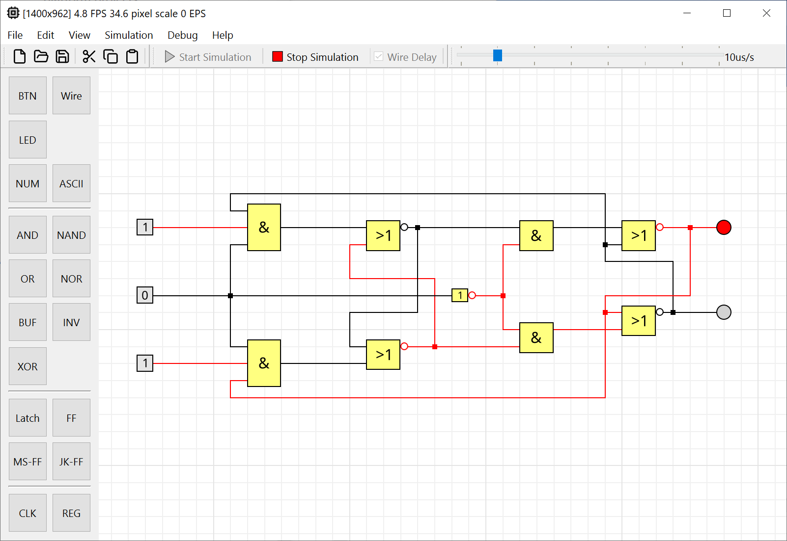

# LogikSim

Design and simulation circuits with predefined logic items.




## Installation

**Windows**

Installer: [Download](https://github.com/christianbrugger/logiksim/releases/download/2.1.0/LogikSim_2.1.0_win_x64.exe)

Portable Zip: [Download](https://github.com/christianbrugger/logiksim/releases/download/2.1.0/LogikSim_2.1.0_win_x64_portable.zip)

**Linux**

LogikSim is available in the [Snap Store](https://snapcraft.io/logiksim).

Install it with:
```
sudo snap install logiksim
```
Start it through the app menu or with:
```
logiksim
```

If you get the message "sudo: snap: command not found", read [here](https://snapcraft.io/docs/installing-snapd) how to install snap on your distribution.


## Build Instructions

* [Windows](documentation/build_windows.md)
* [Linux](documentation/build_windows.md)


## Third-party

Libraries

* Abseil ([Apache-2.0](https://github.com/abseil/abseil-cpp?tab=Apache-2.0-1-ov-file))
* ankerl::unordered_dense ([MIT](https://github.com/martinus/unordered_dense?tab=MIT-1-ov-file))
* AsmJit ([Zlib](https://github.com/asmjit/asmjit?tab=Zlib-1-ov-file))
* Benchmark ([Apache-2.0](https://github.com/google/benchmark?tab=Apache-2.0-1-ov-file))
* Blend2D ([Zlib](https://github.com/blend2d/blend2d?tab=Zlib-1-ov-file))
* Boost ([BSL-1.0](https://github.com/boostorg/boost?tab=BSL-1.0-1-ov-file))
* cppcodec ([MIT](https://github.com/tplgy/cppcodec?tab=MIT-1-ov-file))
* expected ([CC0-1.0](https://github.com/TartanLlama/expected?tab=CC0-1.0-1-ov-file))
* {fmt} ([MIT](https://github.com/fmtlib/fmt?tab=License-1-ov-file))
* Folly ([Apache-2.0](https://github.com/facebook/folly?tab=Apache-2.0-1-ov-file))
* GCE-Math ([Apache-2.0](https://github.com/kthohr/gcem?tab=Apache-2.0-1-ov-file))
* Glaze ([MIT](https://github.com/stephenberry/glaze?tab=MIT-1-ov-file))
* GoogleTest ([BSD-3-Clause](https://github.com/google/googletest?tab=BSD-3-Clause-1-ov-file))
* GSL ([MIT](https://github.com/microsoft/GSL?tab=License-1-ov-file))
* HarfBuzz ([MIT-0](https://github.com/harfbuzz/harfbuzz?tab=License-1-ov-file))
* Qt 6 ([LGPL](http://doc.qt.io/qt-6/lgpl.html))
* range-v3 ([BSL-1.0](https://github.com/ericniebler/range-v3?tab=License-1-ov-file))
* svg2b2d ([MIT](https://github.com/Wiladams/svg2b2d?tab=MIT-1-ov-file))
* whereami ([WTFPL](https://github.com/gpakosz/whereami?tab=License-2-ov-file))
* Zlib ([Zlib](https://github.com/madler/zlib?tab=License-1-ov-file))

Ressources

* Lucide Icons ([ICS](https://github.com/lucide-icons/lucide?tab=ISC-1-ov-file))
* NotoSans Font ([OFL-1.1](https://github.com/notofonts/latin-greek-cyrillic?tab=OFL-1.1-1-ov-file))
* MSVC Runtime ([MS-Runtime-EULA](https://visualstudio.microsoft.com/license-terms/vs2022-cruntime/))

Build Tools (not packaged)

* CMake ([BSD-3-Clause](https://github.com/Kitware/CMake?tab=License-1-ov-file))
* Inno Setup ([InnoSetup](https://github.com/jrsoftware/issrc?tab=License-1-ov-file))
* LLVM Project ([Apache-2.0](https://github.com/llvm/llvm-project?tab=License-1-ov-file))
* Ninja ([Apache-2.0](https://github.com/ninja-build/ninja?tab=Apache-2.0-1-ov-file))
* Snapcraft ([GPL-3.0](https://github.com/canonical/snapcraft?tab=GPL-3.0-1-ov-file))
* snapcraft.yaml Qt6 template ([GPL-3.0](https://github.com/telegramdesktop/tdesktop/tree/dev?tab=License-1-ov-file))
