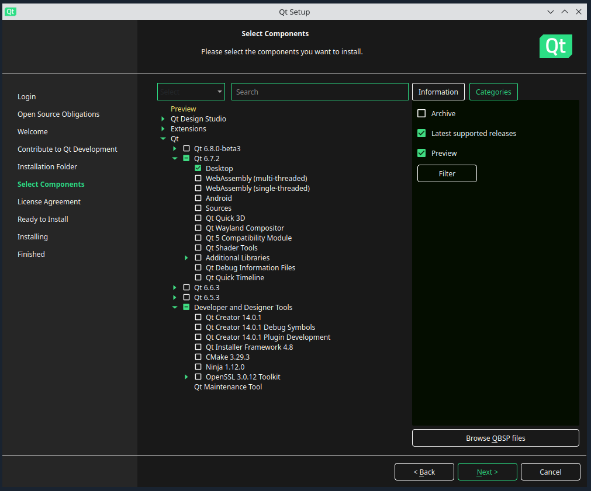

# Build Instructions for Linux

Any modern linux distrubtion that supports Qt 6 should work. Both X11 and Wayland is supported.

*tested with Ubuntu 24.04*

## Build Dependencies

External tools needed for building, not included in this repository.

### Compiler

Both **Clang** and **GCC** are supported. 

#### Clang 17+

```bash
sudo apt install clang
```

*tested with clang++ 18.1.3*

On olders versions manual installation is necessary:

```shell
wget https://apt.llvm.org/llvm.sh
chmod +x llvm.sh

sudo ./llvm.sh 18
```

This installs `apt-get install -y clang-18 lldb-18 lld-18 clangd-18`

Uninstallation:

https://ubuntuhandbook.org/index.php/2023/09/how-to-install-clang-17-or-16-in-ubuntu-22-04-20-04/

#### GCC 12+

```bash
sudo apt install g++
```

*tested with g++ 13.2.0*

### Python 3.11 (optional)

This is optional, only used for some scripts, not the main build.

```bash
sudo apt install python3
```

*tested with Python 3.12.3*

Manual installation on older Ubuntu versions:

```shell
sudo add-apt-repository ppa:deadsnakes/ppa

sudo apt install python3.11
```

### Git

Needed to checkout the sub-modules.

```bash
sudo apt install git
```

*tested with 2.43.0*

### Ninja

The main build system.

```bash
sudo apt install ninja-build
```

*tested with ninja 1.11.1*

### CMake 3.25+

The main build sytem.

```bash
sudo apt install cmake
```

*version 3.28.3*

Manual installation is best done through the pip package

```shell
sudo apt install python3-venv


python3 -m venv env
. env\bin\activate

python -m pip install cmake
```

### CCache (optional)

Used by the build system, if installed, to speed up full re-builds.

```bash
sudo apt install ccache
```

*version ccache 4.9.1*

### Qt 6.4+

Qt can be installed in various ways.

### Installer

Here Qt binaries are downloaded via the installer. This is probably the best solution for development builds. As it gives full control over the version used.

https://www.qt.io/download-qt-installer-oss

The only required package for building is:

- Desktop

Recommended for debugging:

- Sources
- Qt Debug Information Files

Anything else can be disabled



*tested with Qt 6.7.2*

#### Package manager

This is the fasted option to get going. For some distributions the Qt versions are too old, however.

```bash
sudo apt install qt6-base-dev
sudo apt install libqt6svg6
```

Also internal modules are required

```bash
sudo apt install qt6-base-private-dev
```

*tested with Qt 6.4.2*

## External Libraries

External libraries are part of the git repository as submodules.

Check out the required submodules by running:

```bash
python3 external/checkout.py
```

The script initializes and updates all required submodules for the platform to the SHA specified by the current commit.

The project has almost 100 submodules the script parallizes the git operations and should finish within 1-2 minutes depending on the download speed.

Re-run the script in case a different tag / branch / commit is checked out.

## Build Scripts

If you installed the compilers and Qt in the standard locations and want to make a release build you can use the script `scripts/build_linux_clang_release.bat`

The result will be in the `logiksim/_build_linux_clang_release` folders.

## Build Steps

Alternatively for custom builds you can follow the build steps here.

#### Environment Variables

If you have installed Qt from the Installer or build from source add Qt to `CMAKE_PREFIX_PATH`. Replace the version as needed, e.g `6.7.1`:

```bash
export CMAKE_PREFIX_PATH=~/Qt/6.x.x/gcc_64/lib/cmake
```

This works for both clang and gcc.

### Prepare Build Folder

Create an emtpy build folder inside the logiksim git repostiroy root:

```bash
mkdir build
cd build
```

#### Configure

First configure with cmake.

For **debug** builds use:

```bash
cmake .. -G Ninja \
    -DCMAKE_BUILD_TYPE=Debug \
    -DLS_ENABLE_CCACHE=OFF \
    -DLS_ENABLE_PCH=ON \
    -DLS_ENABLE_LTO=OFF \
    -DCMAKE_C_COMPILER=clang \
    -DCMAKE_CXX_COMPILER=clang++
```

For **release** builds use:

```bash
cmake .. -G Ninja \
    -DCMAKE_BUILD_TYPE=Release \
    -DLS_ENABLE_CCACHE=OFF \
    -DLS_ENABLE_PCH=ON \
    -DLS_ENABLE_LTO=ON \
    -DCMAKE_C_COMPILER=clang \
    -DCMAKE_CXX_COMPILER=clang++
```

Configuration should take 15 - 30 seconds.

### Build

Run the build itself:

```bash
ninja
```

This will build all dependencies from source (except Qt) and then build LogikSim.

A complete build from scratch should take about 3-5 minutes depending on the machine.

#### Execution

This should build all the binaries you can run the GUI with:

```bash
./simulation_srp_gui
```

Run the tests with

```bash
./simulation_srp_test
```

Run the benchmark with

```bash
./simulation_srp_benchmark
```

Run the non-gui experimental main (used for testing out new features directly)

```bash
./simulation_srp_main
```
