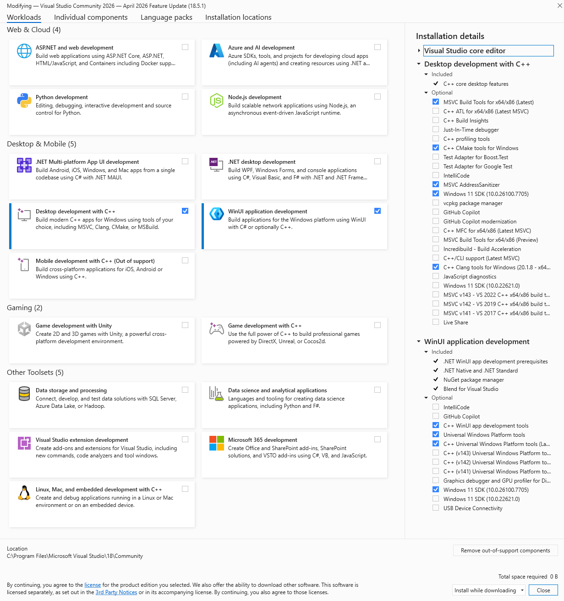
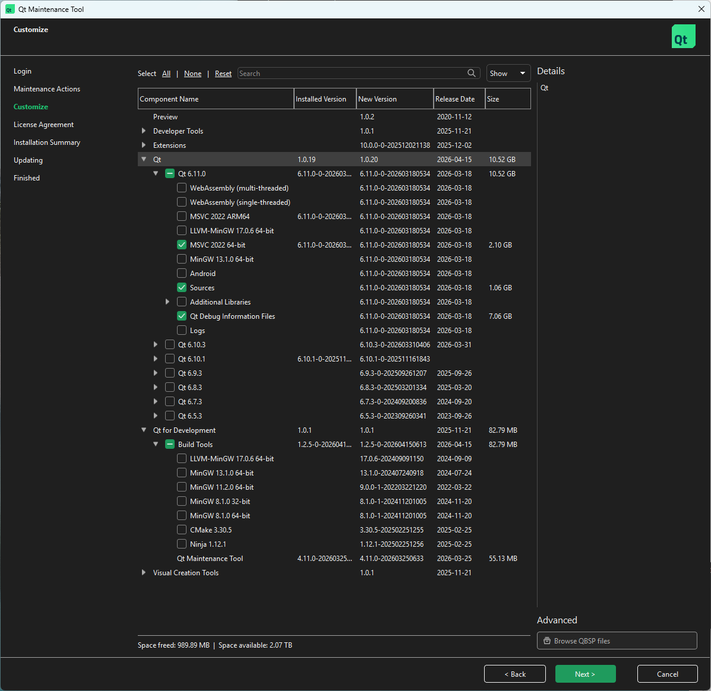

# Build Instructions for Windows


## Build Dependencies

External tools needed for building, not included in this repository.


### Visual Studio Community 2026

Download the Installer from here:

 https://visualstudio.microsoft.com/vs/community/

Make sure to install the following components:

* **Desktop development with C++**

  * **MSVC** - Build Tools for x64/x86 build tools (Latest)

  * **C++ CMake** tools for Windows
  * MSVC **AddressSanitizer**
  * **Windows 11 SDK** (10.0.26100.7705)

  * **C++ Clang** tools for Windows (20.1.8 - x64/x86)

* **WinUI application development**

  * **C++ WinUI app development** tools
  * **Universal Windows Platform** tools
  * **C++ Universal Windows Platform** tools (Latest)
  * **Windows 11 SDK** (10.0.26100.7705)



*tested with Visual Studio Community 18.5.1*


### Python 3.11+ (optional)

This is optional, only used for some scripts, not the main build.

Download the Installer from here:

https://www.python.org/downloads/

Make sure `python` is available in the PATH.

*tested with Python 3.13.5*

### Git

Download the Installer from here:

https://git-scm.com/download/win/

Make sure `git` is avaiable in the PATH.

*tested with 2.50.1*

### Qt 6.4+

Qt is not build from source and is best installed with the Qt Installer:

https://www.qt.io/download-qt-installer-oss

The only required package for building is:

* MSVC 2019 64-bit (before Qt 6.8)
* MSVC 2022 64-bit (beginning Qt 6.8)

Recommended for debugging:

* Sources
* Qt Debug Information Files

Anything else can be disabled



*tested with Qt 6.11.0*

Add a system wide environment variable:

```
CMAKE_PREFIX_PATH
C:\Qt\6.11.0\msvc2022_64\lib\cmake
```

Add this to `PATH`:

```
C:\Qt\6.11.0\msvc2022_64\bin
```


## External Libraries

External libraries are part of the git repository as submodules.

Check out the required submodules by running:

```cmd
python3 external/checkout.py
```

The script initializes and updates all required submodules for the platform to the SHA specified by the current commit.

The project has almost 100 submodules the script parallizes the git operations and should finish within 1-2 minutes depending on the download speed.

Re-run the script in case a different tag / branch / commit is checked out.


## Build Steps

### Environment Variables

Add Qt to `PATH` and `CMAKE_PREFIX_PATH`. Replace the version as needed, e.g `6.10.1`:

```cmd
set PATH=C:/Qt/6.x.x/msvc2022_64/bin;%PATH%
set CMAKE_PREFIX_PATH=C:/Qt/6.x.x/msvc2022_64/lib/cmake
```

### Terminal

Open [`Windows Terminal`](https://apps.microsoft.com/detail/9n0dx20hk701) and open a `Developer PowerShell for VS 18`. This will make `cmake`, `ninja` and`clang-cl` avaiable:

### Prepare Build Folder

Create an emtpy build folder inside the logiksim git repostiroy root:

```cmd
mkdir build
cd build
```

#### Configure

Open `Developer Command Prompt for VS 18`

For **debug** builds use:

```cmd
cmake --preset win-clang-debug

cd build\win-clang-debug
ninja
```

For **release** builds use:

```cmd
cmake --preset win-clang-release

cd build\win-clang-release
ninja
```

Configuration should take 30 - 60 seconds.

#### Build

Run the build

```cmd
ninja
```

This will build all dependencies from source (except Qt) and then build LogikSim.

A complete build from scratch should take about 3-5 minutes depending on the machine.

#### Execution

This should build all the binaries you can run the GUI with:

```cmd
./ls_gui
```

Run the tests with

```
./ls_test_core
./ls_test_gui
```

Run the benchmark with

```
./ls_benchmark
```

Run the non-gui experimental main (used for testing out new features directly)

```
./ls_cli
```


# WinUI GUI

The WinUI GUI is in development and need to build inside Visual Studio 18 by opening the project in `src/main_winui/main_winui.sln`.

First the NuGet packages should be installed, after which both the debug and release build can be started.
