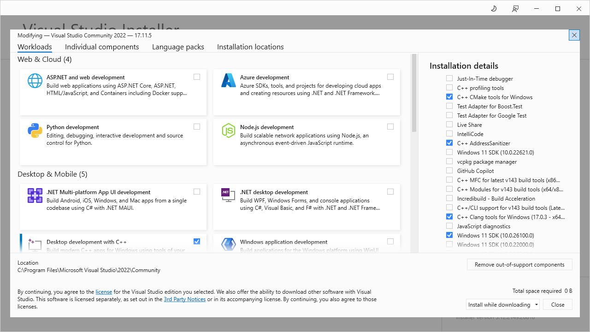

# Fuzz Testing

Fuzz testing builds are supported under Windows (MSVC) and Linux (Clang). All of the fuzz-testing executables use libFuzzer under the hood. The documentation is available here:

https://llvm.org/docs/LibFuzzer.html


## Usage

### 1. Build fuzz test executables

Run cmake configure of the desired configuration:

```shell
cmake . --list-presets
```

These are at the time of writing this the available configurations:

```
"win-msvc-fuzz-addr-debug"      - MSVC Fuzz+Addr Debug
"win-msvc-fuzz-relwithdeb"      - MSVC Fuzz RelWithDeb
  
"linux-clang-fuzz-debug"        - Clang Fuzz Debug
"linux-clang-fuzz-addr-debug"   - Clang Fuzz+Addr Debug
"linux-clang-fuzz-debug-cov"    - Clang Fuzz+Cov Debug
"linux-clang-fuzz-relwithdeb"   - Clang Fuzz RelWithDeb
```

Run for example:

```shell
cmake . --preset=linux-clang-fuzz-debug
```

Then compile

```shell
cd build/linux-clang-fuzz-debug
ninja
```

This will produce all the fuzztest executables

### 2. Run Short times

Run a specific fuzz-test:

```shell
./ls_fuzz_core -max_len=256
```

Address Sanitizer leak detection can take a long time. It can be disabled with:

```shell
./ls_fuzz_core -detect_leaks=0 -max_len=256
```

The max length limits the length of the binary input. Here are the recommended lengths:

* Modifier-History: 256

### 3. Run Continuously

This is good to really extensivly test the search space. For this is it necessary to collect a corpus of interesting inputs. This can be done for a single instance with:

```shell
mkdir corpus
./ls_fuzz_core -detect_leaks=0 -max_len=256 corpus
```

Or using multiple cores:

```shell
mkdir corpus
./ls_fuzz_core -detect_leaks=0 -max_len=256 -jobs=8 -workers=8 corpus
```

The above runs 8 instances and this can be easily for 12+ hours. The process can be aborted and resumed. Reusing already found inputs.

### 4. Minimize Corpus

Once the coverage converges it is best to minimize the corpus and select only the inputs that best represent the corpus. This is done by running:

```shell
mkdir corpus_min
./ls_fuzz_core -merge=1 corpus_min corpus
```

This will e.g. condense down 100k inputs to just 11k in our example.

### 5. Calculate Coverage

When developping a new or extending an existing fuzz-test, a good metric for the quality is how much of the code is hit by the fuzzing enginge, as well as how quickly.

To visualize this coverage one has to build a target with coverage enabled. E.g.:

```shell
cmake . --preset=linux-clang-fuzz-debug-cov

cd build/linux-clang-fuzz-debug-cov
ninja
```

Then one needs to run this executable on the corpus one wants to check the coverage:

```shell
./ls_fuzz_core -detect_leaks=0 -max_len=256 -max_total_time=1 corpus_min
```

Then the coverage can be visalized with:

```shell
llvm-profdata-18 merge default.profraw -o default.profdata

rm -rf html && llvm-cov-18 show ls_fuzz_core -instr-profile=default.profdata -format=html -output-dir=html -ignore-filename-regex=external/.*

cd html && xdg-open localhost:8000 && python3 -m http.server
```

### 6. Upload Corpus

To improve the fuzz-test within the CI it it best to upload a corpus generated from a long run. For that the this repository is used:

https://github.com/christianbrugger/logiksim_fuzzing_corpus/

To pack up a new corpus its best to minimize and combine it with the old one:

```
wget https://github.com/christianbrugger/logiksim_fuzzing_corpus/raw/refs/heads/main/corpus_modifier_history.tar.xz
tar -xf corpus_modifier_history.tar.xz
mv corpus_modifier_history corpus_modifier_history_old

mkdir corpus_modifier_history
./ls_fuzz_core -merge=1 corpus_modifier_history corpus corpus_modifier_history_old

tar -cJf corpus_modifier_history.tar.xz corpus
```

Then commit the new `corpus_modifier_history.tar.xz` file to the corpus repository.


## Installation

### Windows

On Windows MSVC needs to be installed, as well as the sub-packages:

* C++ AddressSanitizer
* C++ Clang tools for Windows



Then build a cmake target that includes **fuzz** in its name.

### Ubuntu

For Ubuntu simply **clang** and **llvm** need to be installed:

```shell
sudo apt install clang llvm
```

