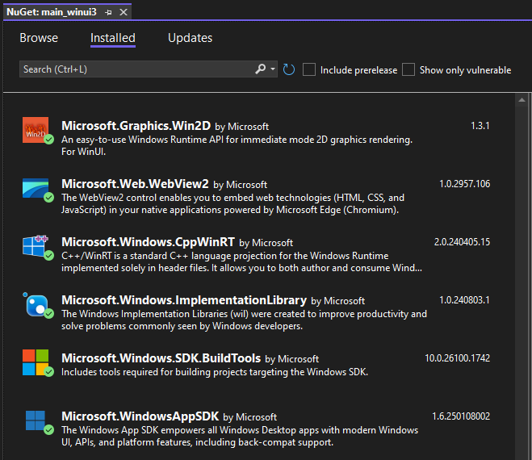
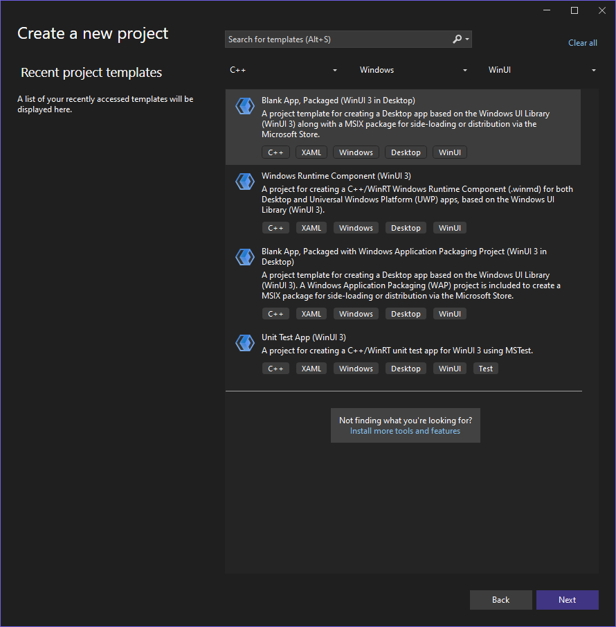
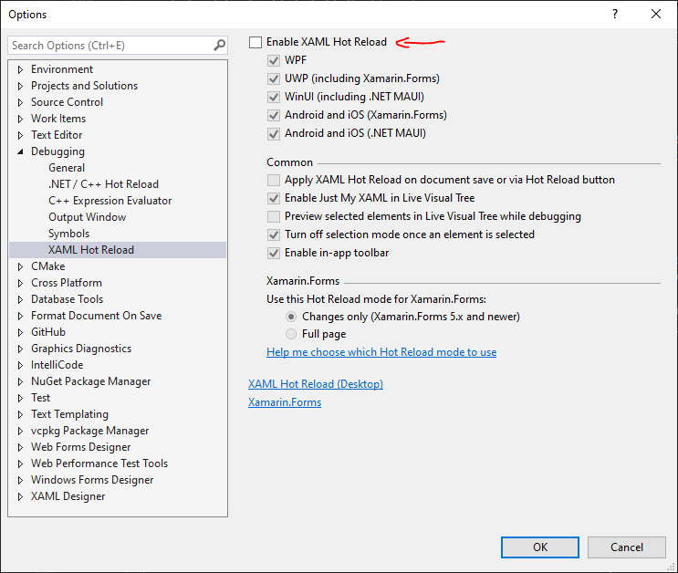
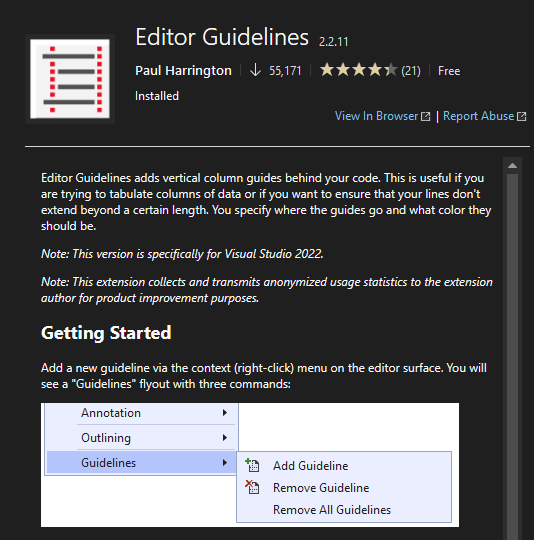
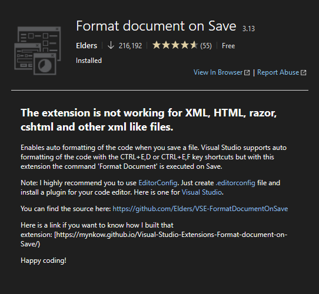

### Compiler Settings

| Setting                         | Value | Flag           | Configuration |
| ------------------------------- | ----- | -------------- | ------------- |
| C++ Standard                    | C++20 | `/std:c++20`   | All           |
| Conformance Mode                | Yes   | `/permissive-` | All           |
| Tread Compile Warning as Errors | Yes   | `/WX`          | All           |
| Control Flow Guard              | Yes   | `/guard:cf`    | Release       |
| Additional Options              |       | `/utf-8`       | All           |
| **Linker Setting**              |       |                | All           |
| Tread Link Warning as Errors    | Yes   | `/WX`          | All           |
| CET Shadow Stack Compatible     | Yes   | `/CETCOMPAT`   | All           |


### Libraries:

* Dwmapi.lib


### Packaging Adjustments

Right click Solution: Unload Project, then edit project file.

Make the following changes to the `main_winui3.vcxproj`:

```xml
<Project ...>
  <PropertyGroup Label="Globals">
    ...
    <AppxPackage>false</AppxPackage>
    <WindowsPackageType>None</WindowsPackageType>
	<WindowsAppSDKSelfContained>true</WindowsAppSDKSelfContained>
	<OutputType>WinExe</OutputType>
  </PropertyGroup>
  ...
</Project>
```


### NuGet Packages

Additioal Packages:

* **Microsoft.Graphics.Win2D**

Update all other packages. Result:



### Project Template

* Run with: **Visual Studio 2022 17.11.5**

* Template Name: **Blank App, Package (WinUI3 in Desktop)**

* Project Name: **main_winui3**
* Project Folder: **`../logiksim/src`**
* Enable: Place solution in the same directory.



## Visual Studio Settings

### Disable XAML Hot Reload

Messes up Program shutdown, as a refernece to Application is held.




### Extensions

These are optional.


##### Editor Guidelines

https://marketplace.visualstudio.com/items?itemName=PaulHarrington.EditorGuidelinesPreview




##### Format document on Save

https://marketplace.visualstudio.com/items?itemName=mynkow.FormatdocumentonSave


